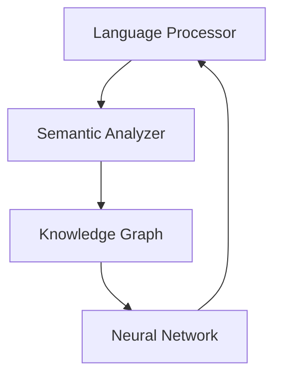

# 🧠 Neural Interface

<div align="center">
  
  
  [](https://www.typescriptlang.org/)
  [](https://reactjs.org/)
  [](https://www.tensorflow.org/js)
  [](https://vitejs.dev/)
  [](https://tailwindcss.com/)

  *An advanced AI chat interface featuring neural network-based natural language processing, semantic analysis, and adaptive learning capabilities, wrapped in a cyberpunk-inspired Matrix theme.*
</div>

## ✨ Features

### 🤖 Advanced Language Processing
- Deep contextual understanding
- Real-time semantic analysis
- Multi-language support
- Dynamic learning capabilities
- Context-aware responses

### 🔮 Neural Network Integration
- TensorFlow.js powered processing
- Real-time text embeddings
- Pattern recognition
- Continuous learning
- Advanced response generation

### 📚 Knowledge Management
- Dynamic knowledge graph
- Adaptive learning
- Technical expertise
- Best practices integration
- Framework knowledge

## 🛠️ Technical Architecture

### Core Systems



#### 1️⃣ Language Processor
- Natural language understanding
- Technical content detection
- Code analysis
- Entity recognition

#### 2️⃣ Semantic Analyzer
- Context management
- Coherence calculation
- Relationship mapping
- Pattern detection

#### 3️⃣ Knowledge Graph
- Concept relationships
- Technical knowledge base
- Framework expertise
- Best practices

#### 4️⃣ Neural Processing
- TensorFlow.js integration
- Text embeddings
- Similarity computation
- Pattern recognition

## 🚀 Getting Started

### Prerequisites
- Node.js 18+
- npm 9+

### Installation

```bash
# Clone the repository
git clone https://github.com/yourusername/neural-interface.git

# Install dependencies
npm install

# Start development server
npm run dev

# Build for production
npm run build
```

### Environment Setup

Create a `.env` file in the project root:

```env
# Required environment variables (replace with your values)
VITE_APP_NAME=neural-interface
VITE_APP_VERSION=1.0.0
```

> ⚠️ **Security Note**: Never commit sensitive API keys or secrets to version control. Use environment variables for all sensitive data.

## 💻 Development

### Project Structure
```
neural-interface/
├── src/
│   ├── components/      # Reusable UI components
│   ├── features/        # Feature modules
│   ├── hooks/          # Custom React hooks
│   ├── pages/          # Page components
│   ├── utils/          # Utility functions
│   └── types/          # TypeScript types
├── public/             # Static assets
└── tests/              # Test files
```

### Key Technologies
- **Frontend**: React, TypeScript, TailwindCSS
- **State Management**: React Hooks
- **Machine Learning**: TensorFlow.js
- **Build Tool**: Vite
- **Testing**: Vitest

## 🔒 Security Features

- Environment variable protection
- API key management
- Input sanitization
- Secure state management
- Rate limiting

## 🤝 Contributing

1. Fork the repository
2. Create a feature branch
   ```bash
   git checkout -b feature/amazing-feature
   ```
3. Commit your changes
   ```bash
   git commit -m 'Add amazing feature'
   ```
4. Push to the branch
   ```bash
   git push origin feature/amazing-feature
   ```
5. Open a Pull Request

### Code Style
- Follow the existing code style
- Use TypeScript strictly
- Write meaningful commit messages
- Add tests for new features

## 📄 License

This project is licensed under the MIT License - see [LICENSE.md](LICENSE.md) for details.

## 🙏 Acknowledgments

- TensorFlow.js team
- React community
- Matrix design inspiration
- Open-source contributors

---

<div align="center">
  <strong>Built with 💚 by the Neural Interface Team</strong>
</div>